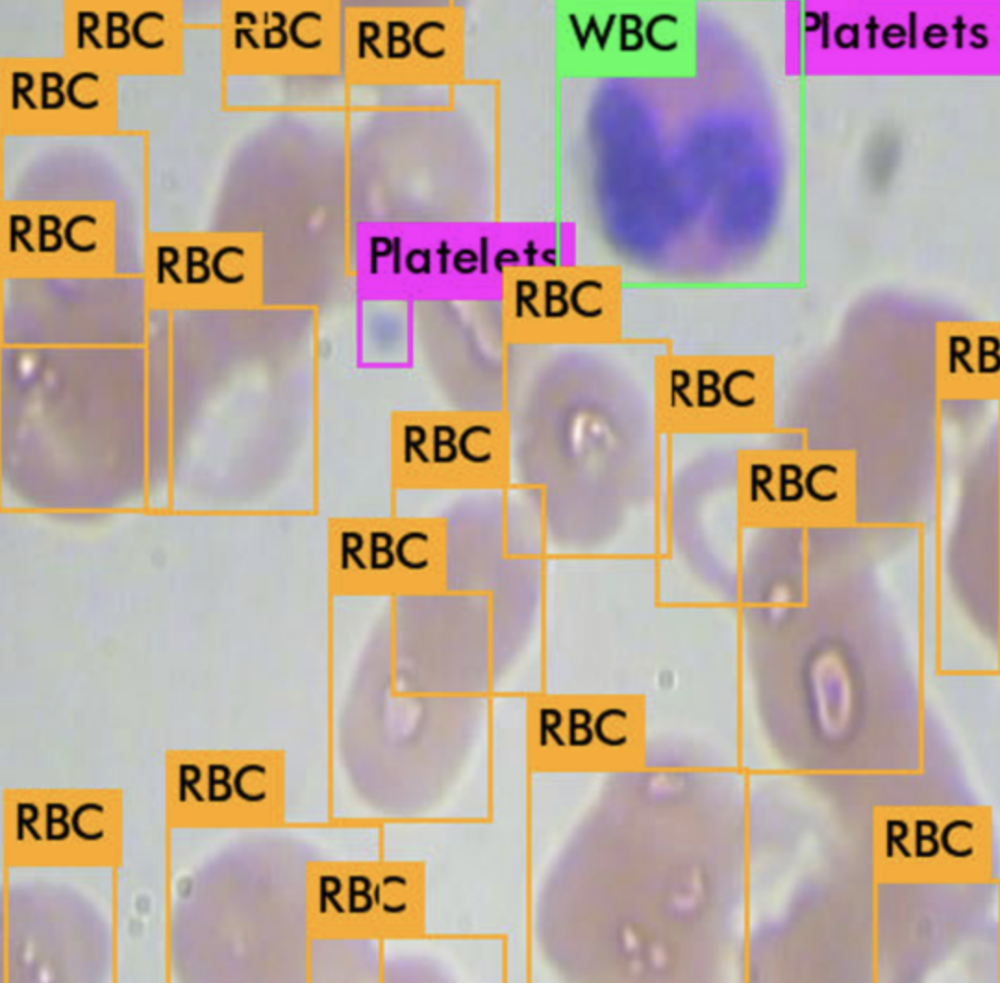
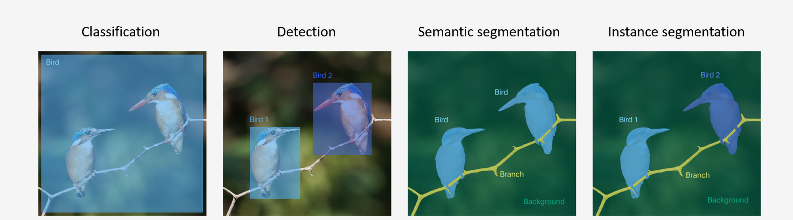
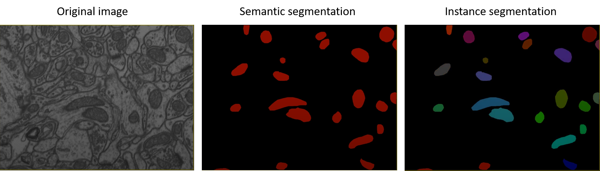

# Image Classification

~ what is present in the image?

Classification takes place at whole image level. Each image is classified into some classes.  Image classification is mainly useful when there is a need of getting abstract level information from the image 

For eg. given categories: holo, mero and para clones, whole image is classified as one of these. 

Labeling: Each image is assigned one label

# Object detection

~ what is present in the image and where - Bounding box(BBox) around object

Object detection is used to identify multiple objects belonging to different categories. It refers to drawing BBox around object of interest in the image and assigning a specific class to it.  

For eg. RBC, WBC and Platelets detection in an image

Labeling: Draw BBox around each object in the image and assign some class to each bbox.

# Segmentation

~ what is present in the image at pixel level. Each pixel of the image is classified into one of the given classes.

For eg. given categories: cytoplasm, nucleus and mitochondrion, each pixel in the image is classified as one of these.

For labeling: Contours are drawn for each object and they are assigned a specific class

There are two types of segmentation based on how different instance of the same class are labeled - Semantic segmentation and Instance segmentation.

## Semantic  segmentation

all pixels corresponding to a class are given the same pixel value

### Instance segmentation

all pixels corresponding to each instance (or object) of a class are given unique values

